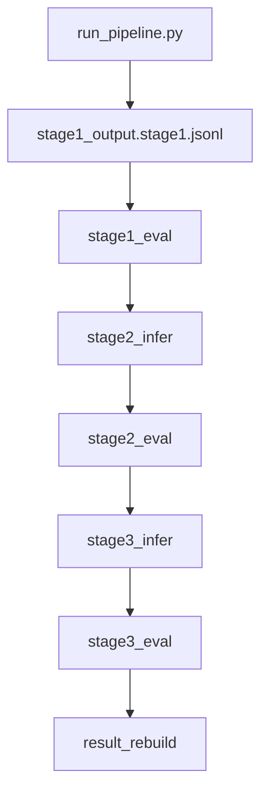

## MathAgent Architecture (as-implemented)

### Pipeline 流程图（更新版）

> 说明：忽略 run_infer.sh / simple_pipeline.py，仅描述实际 pipeline 的阶段流转。

### 顶层设计（泛化数据生成器 / Scenario-driven）

`MathAgent_Idea.drawio` 对应的核心思想是：

- **进入 MathAgent 的必须是标准数据**：外部的数据处理器（例如你说的 UDataset）负责把原始数据转换成标准 schema/wrapper。
- **MathAgent 内部三段式**：
  - **生产数据（Production）**：`infer` 产出 raw generations / rawdata（多轮采样/多候选）
  - **评估数据（Eval）**：规则提取 +（可多输入的）eval + vote/一致性统计
  - **结果构建（Result Build）**：融合 production+eval 产物与 build 规则，产出最终可入库数据
- **“多轮投票”只是一个场景**：它通过配置文件描述“轮次/步骤顺序”，底座是通用的 scenario 执行器。

当前落地方式：

- **通用底座**：`src/generator/`（按 scenario 配置顺序执行一组 ops）
- **多轮投票场景**：`config/scenarios/multiround_vote.json`
- **模型/采样/阈值**：仍由 `config/llm_models.json` 描述（routes/stage_params/thresholds/options）

### 源码分层（真实目录）

- **CLI / Orchestration**：`src/run_pipeline.py`
  - 唯一入口；既支持 **Route-A modular**（`stage1_infer/stage1_eval/stage2_infer/stage2_eval/stage3_infer/stage3_eval`），也支持 **scenario**（`--mode scenario --scenario-config ...`）
  - 负责工件落盘、断点续跑（done-set/status）、路由（是否进入下一阶段）
  - 启动时可进行 **connection-error 数据清理**（见“运行时稳定性”）
- **Generator / Scenario runner（通用底座）**：`src/generator/`
  - `scenario_runner.py`：按配置顺序执行步骤（底座不绑定“多轮投票”）
  - `scenario_config.py`：scenario JSON schema（最小模板替换：`${RAW_INPUT}` / `${OUT_DIR}`）
- **Core (Domain)**：`src/core/`
  - `stages.py`：输入归一化、选项映射、答案抽取（`FINAL:` / `\\boxed{}`）、规则等价判别、Stage1 boxed 统计解析
  - `prompt_assemble.py`：拼装 Stage1 evaluator `prompt`（sample.jsonl 风格）
  - `voting.py`：多数投票（majority vote）
- **IO**：`src/dataio/`
  - `jsonl_io.py`：JSONL 读写（`write_jsonl_atomic` 原子写入）
  - `sample_schema.py`：输入/输出 schema wrapper 归一（对齐 sample 风格字段）
- **Infra (LLM)**：`src/infra/`
  - `llm_router.py`：读取 `config/llm_models.json`（models/routes/stage_params/thresholds/options），并对外提供统一 `generate_n()`
  - `llm_client.py`：OpenAI-compatible HTTP 客户端（retry/backoff、debug 打印、可选 SSE stream），以及 **connection refused 恢复等待/可选重启**（env 控制）
  - `llm_helper.py`：LLM connect/start/restart/healthcheck 的 helper（由 `options.vllm_*` 驱动）

### 配置中心：`config/llm_models.json`

- **models**：不同“模型实例”的基础参数（如 base/think_fast/think_slow，对应 endpoint/model/timeout/retry）
- **routes**：`stage_name -> model_key` 路由（例如 `stage2_solve` 走 think_fast）
- **stage_params**：每个 stage 的采样参数（`n/temperature/max_tokens`）
- **thresholds**
  - `min_votes_to_accept`：接受阈值（共识强度）。Stage2/Stage3 的 `final_vote_count >= min_votes_to_accept` 视为“本阶段收敛”
- **options**
  - `finish_early`：solve prompt 的“提前结束/猜答案”提示（软控制）
  - `think_tag_default / think_tag_by_stage / think_tag_by_profile`：向 user content 注入 tag（例如 `/think`、`/no_think`）
  - `debug_print_prompts / debug_print_outputs / debug_stream_outputs`：调试打印与可选流式输出（仅影响日志，不影响落盘结构）
  - `generate_n_max_workers`：`LLMClient.generate_n()` 内部并发上限（注意并发过高会放大 vLLM 负载峰值）

### 场景配置：`config/scenarios/*.json`

- **目的**：把“轮次/步骤顺序”从代码里抽出来，描述为配置；从而让“多轮投票”变成**可替换场景**。
- **默认场景**：`config/scenarios/multiround_vote.json`
  - `steps[]`：一个有序的 `op` 列表（如 `stage1_infer -> stage1_eval -> stage2_infer -> ... -> result_rebuild`）
  - `input`：支持 `${RAW_INPUT}` 与 `${OUT_DIR}` 两个变量

### 工件（Artifacts）与断点续跑（Done Sets）

实现中“是否跳过某个 uuid”的依据不是“文件存在”，而是 **done-set/status**：

- **Stage1 eval**：用 `stage1/<prefix>.status.stage1.jsonl` 的 uuid map 判断是否已处理
- **Stage2 infer**：用 `stage2/<prefix>.stage2_infer.stage2.jsonl` 的 uuid set 判断是否已 infer
- **Stage2 eval**：用 `stage2/<prefix>.status.stage2.jsonl` 的 uuid set 判断是否已 eval
- **Stage3 infer**：用 `stage3/<prefix>.stage3_infer.stage3.jsonl` 的 uuid set 判断是否已 infer
- **Stage3 eval**：用 `stage3/<prefix>.status.stage3.jsonl` 的 uuid set 判断是否已 eval

因此：一旦某个 uuid 被写进了上述“done 文件”，后续重跑默认会跳过它（除非你清理对应行）。

### Pipeline 数据流（实现口径）

#### Stage0：输入副本

- 单文件模式输出：`stage0.jsonl`
- 目录模式输出：`<prefix>.stage0.jsonl`

#### Stage1（solve + eval/路由）

- **solve（full 或 stage1_infer）**
  - 对每题采样 `stage_params.stage1_solve.n`
  - 落盘：`stage1/<prefix>.stage1_infer.stage1.jsonl`（modular）或 full 模式中对应的 raw 工件
  - 内部会做：
    - 选项映射注入：`append_choice_map_if_any(normalize_for_model(question))`
    - 抽取：`extract_boxed_answer` / `extract_final_answer`，选择题会进一步 `standardize_choice_answer`
    - 投票：`majority_vote(...)`
- **eval（stage1_eval）**
  - **优先解析**：从 `stage1_output.stage1.jsonl` 的 `output` 里解析 `\\boxed{解答正确：x，解答错误：y}`（不需要 LLM）
  - **解析失败兜底**：才会用 stored `prompt + [GOLD_STANDARD_ANSWER]=...` 调 `stage1_eval`
  - 路由（stage1_eval 模式）：`ok >= min_votes_to_accept` 则 accepted，否则进入 Stage2（并写 `stage2_input.stage2.jsonl`）

> 注意：Stage1 的路由规则在不同执行模式有差异：
> - **stage1_eval 模式**：使用 boxed counts 的 ok/bad 统计
> - **full 模式**：使用 solve 投票的 `majority_count`（共识强度）决定是否进入 Stage2

#### Stage2（infer + eval/归档/路由）

- **infer（stage2_infer）**
  - 输入优先：`stage2_input.stage2.jsonl`；兼容：也可直接给 `stage1_output.stage1.jsonl`，代码会从 `status.stage1` 反推任务列表
  - 对每题采样 `stage_params.stage2_solve.n`，得到 `raw_model_outputs[]`
  - **抽取器**：调用 LLM 做批量抽取（`stage2_extract`），把每个 raw 输出抽取为 canonical answer（JSON 数组）
  - 落盘：`stage2/<prefix>.stage2_infer.stage2.jsonl`
- **eval（stage2_eval）**
  - 对每个采样答案，先 `rule_equivalent(pred,gold,choice_map)`；只有返回 `None` 才升级到 LLM 裁决 `stage2_judge`
  - 记录 attempts（raw_text/extracted/判别结果）并投票（会过滤空答案，避免 error 导致伪共识）
  - 生成 `majority_answer` 与 `final_answer/final_vote_count`（规则：majority_count >= min_votes_to_accept 则 final_source=majority，否则 fallback=gold）
  - 路由：`final_vote_count < min_votes_to_accept` 进入 Stage3，否则 accepted

#### Stage3（infer + eval/归档/路由）

Stage3 结构与 Stage2 类似：

- **infer**：`stage3_input.stage3.jsonl` -> `stage3_infer.stage3.jsonl`
- **eval**：写 `stage3_archive`、`status.stage3`，并产出 `accepted_bank` 与（仅当 majority 收敛时）`result`

#### Result / Accepted Bank（实现口径）

- `accepted_bank.stage_final.jsonl`：Stage2/Stage3 的最终接受记录（可能是 majority，也可能是 fallback）
- `result/*.result.stage_final.jsonl`：**只收录** `final_source="majority"` 的结果（实现明确排除了 fallback）

### 运行时稳定性（Resilience）

#### 1) vLLM connection refused 自动恢复（不改 config）

当 vLLM 挂掉或重启时，客户端可能报 `Errno 111 Connection refused`。`src/infra/llm_client.py` 支持 env 驱动恢复：

- `MATHAGENT_LLM_WAIT_ON_CONNREFUSED_S`：等待恢复的秒数（默认 0，关闭）
- `MATHAGENT_LLM_RESTART_CMD`：可选重启命令（最多尝试一次，然后轮询健康检查）
- `MATHAGENT_LLM_HEALTH_URL`：健康检查 URL（默认 `<base_url>/v1/models`）
- `MATHAGENT_LLM_CONNREFUSED_LOG`：打印恢复日志

#### 2) 启动时清理 connection-error 数据（保证 rerun 能“带上这条数据”）

由于 pipeline 会把 uuid 写入 infer/status，导致 rerun 跳过；`src/run_pipeline.py` 启动时默认会：

- 扫描 `--out` 下的 JSONL（archive/status/infer/raw_generations/accepted_bank/result）
- 找到包含 connection/network error marker 的 uuid（例如 `[LLM_ERROR ... connection refused ...]`）
- 从上述“派生工件”中删除该 uuid 对应的行（**不会删除** stage0、stage2_input、stage3_input、stage1_output）

可通过 `MATHAGENT_DISABLE_PURGE_CONN_ERRORS=1` 关闭。

### 规格补充（当前实现的约束与约定）

- **抽取优先级**：`extract_boxed_answer` > `extract_final_answer`；抽取结果为空时不会参与投票
- **规则判别优先**：`rule_equivalent` 返回 True/False 即直接判定，只有 `None` 才会调用 LLM judge
- **多数投票口径**：投票基于“规范化后的答案字符串”，并过滤空答案以避免错误伪共识
- **Stage2/3 final 规则**：`majority_count >= min_votes_to_accept` 则 `final_source="majority"`；否则 `final_source="no_majority"`（没有答案，不回退到 gold）
- **Result 只收 majority**：`result/*.result.stage_final.jsonl` 仅收录 `final_source="majority"` 的样本

