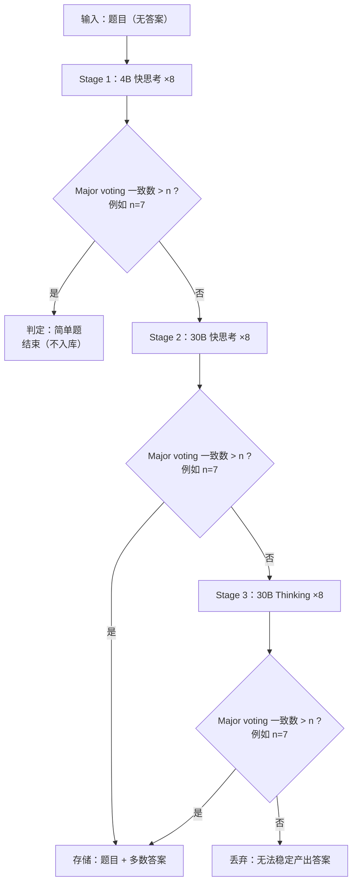

# MathAgent：高难度数学题筛选与答案生成流程

## 判定与产出

- **一致性判定**：每个 Stage 生成 8 个答案，用 **major voting** 统计“最多数答案”的出现次数；若 **> n** 则认为答案稳定。
- **输出数据**：仅当 Stage 2 或 Stage 3 达到稳定一致性时，**存储（题目 + 多数答案）**；否则按流程 **结束或丢弃**。

