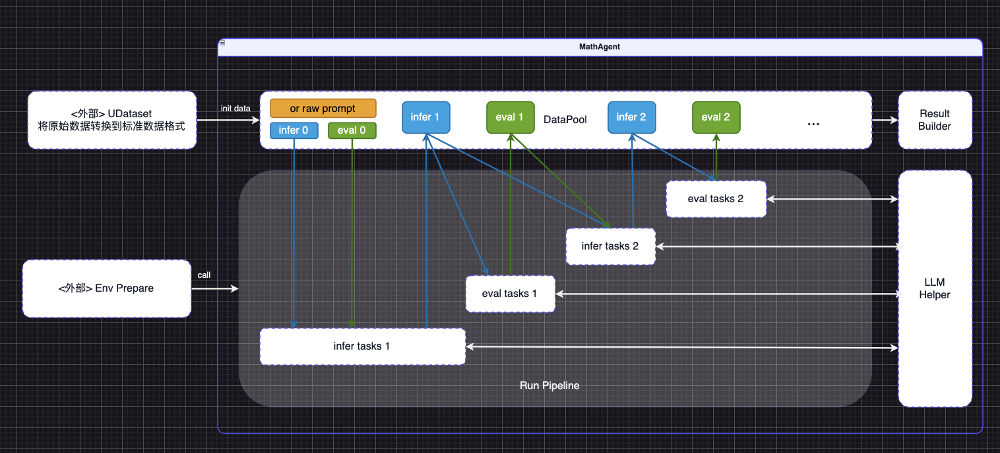
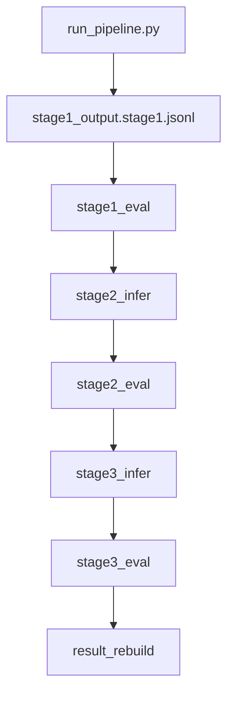
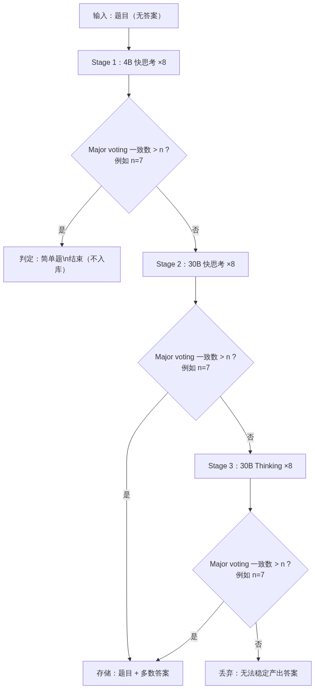

# MathAgent（泛化数据生成流水线）

本仓库是一套**泛化的“数据生成流水线”框架**：以 **DataPool + infer/eval 循环 + Result Builder + LLM Helper** 为抽象核心。  
设计理念：**先完整介绍泛化框架**；文末用**一个小例子**说明当前实现的数学多轮多数投票（majority vote）使用场景。




---

## 1. 设计规格（与 MathAgent_IDEA.drawio 对齐）

### 1.1 外部边界

- **&lt;外部&gt; UDataset**：将原始数据转换为**标准数据格式**后写入 DataPool（init data）；本框架不关心上游数据源形态。
- **&lt;外部&gt; Env Prepare**：运行前环境准备（如 vLLM/API、采样参数等），由调用方或部署脚本负责；对应 drawio 中注入到“Run Pipeline”环境的虚线区域。

### 1.2 内部核心（MathAgent 泳道）

- **DataPool**（虚线框）
  - 入口：**init data**（标准 schema）；或 **or raw prompt** 等直通路径。
  - 全流程数据在此池中流转，供各阶段读写。
- **infer / eval 交替循环**
  - **infer k** / **eval k**：第 k 轮的“生产”与“评估”执行节点（图中实心块）。
  - **infer tasks k** / **eval tasks k**：第 k 轮对应的任务定义块（图中虚线框），由 **Run Pipeline** 按顺序驱动；可调用 **LLM Helper**。
  - 典型流转：DataPool → infer 0 → eval 0 → infer tasks 1 → infer 1 → eval tasks 1 → eval 1 → infer tasks 2 → infer 2 → eval tasks 2 → eval 2 → …
- **Result Builder**（虚线框）：消费 DataPool 的 production + eval 结果，按“结果构建规则”产出最终可入库/可交付数据。
- **LLM Helper**（虚线框）：各 infer/eval 任务块共用；统一封装 LLM 调用、路由、重试与可选的流式/调试能力。

---

## 2. 运行方式与 CLI

`src/run_pipeline.py` 提供三种 op：

| op | 作用 |
|----|------|
| **infer** | 生产 `<out>/infer.jsonl`（或按 stage 命名的 infer 工件） |
| **eval** | 消费 `<input>/infer.jsonl`，产出 `<out>/status.jsonl`（或对应 status 工件） |
| **result_rebuild** | 消费 `<run_dir>/**/{infer.jsonl,status.jsonl}`，产出 `<run_dir>/result/result.stage_final.jsonl` |

- **Stage** 不由 CLI 显式指定，由**输出目录名**体现（如 `.../stage1`、`.../stage2`）。
- **链式执行**为数据驱动：下游 `infer` 只处理上游 `status.jsonl` 中 `accepted=false` 的样本。

### 输入数据格式

当 `--mode infer` 且 `--input` 为 JSONL 文件或目录时，每行需为包含至少下列其一字段的 JSON 对象：

- `question` / `prompt` / `text`

实际使用的字段由 `config/llm_models.json` 控制：

- `options.input.question_key_priority`（默认 `["question","prompt","text"]`）
- `options.input.raw_input_glob`（目录模式下，默认 `"*.jsonl"`）

---

## 3. 源码分层

| 层次 | 路径 | 说明 |
|------|------|------|
| **CLI / 编排** | `src/run_pipeline.py` | 唯一入口；支持 Route-A modular 与 scenario；工件落盘、断点续跑、路由、启动时 connection-error 清理 |
| **Generator（通用底座）** | `src/generator/` | 按配置顺序执行步骤；scenario 配置（如 `steps[]`、`${RAW_INPUT}` / `${OUT_DIR}`） |
| **Core（可替换领域）** | `src/core/` | 当前实现为示例场景的领域逻辑（见第 8 节），可替换 |
| **IO** | `src/dataio/` | JSONL 读写、schema 归一 |
| **Infra (LLM)** | `src/infra/` | `llm_router` / `llm_client` / `llm_helper`：配置、HTTP 客户端、重试与可选的 vLLM 自启/恢复 |

---

## 4. 配置

- **config/llm_models.json**：`models`、`routes`、`stage_params`、`thresholds`、`options`（含 vLLM 自启/恢复、调试、并发等）。
- **config/scenarios/*.json**：将轮次/步骤顺序抽成配置；`steps[]` 为有序 op 列表，`input` 支持 `${RAW_INPUT}`、`${OUT_DIR}`。

---

## 5. 工件与断点续跑

是否跳过某条样本由 **done-set/status** 决定（而非仅看文件是否存在）。各 stage 的 infer/status 工件落盘后，重跑会默认跳过已存在的 uuid；需要重跑时可清理对应派生工件或使用启动时 connection-error 清理（见下节）。

---

## 6. 运行时稳定性

- **vLLM connection refused**：由 `config/llm_models.json` 的 `options` 或环境变量驱动等待/重启与健康检查（详见配置与代码内注释）。
- **启动时清理 connection-error 数据**：默认扫描 `--out` 下派生 JSONL，移除含 connection/network error marker 的 uuid 对应行，使重跑能再次处理这些样本；不删除 stage0、stage2_input、stage3_input、stage1_output。可通过配置关闭。

---

## 7. 参考：端到端命令与 vLLM 配置

### 端到端示例（stage1 → stage3 → result）

```bash
RUN_DIR=datasets/out/demo_3

# Stage1
PYTHONPATH=src python3 src/run_pipeline.py --mode infer --input datasets/input --out "$RUN_DIR/stage1" --llm-config config/llm_models.json
PYTHONPATH=src python3 src/run_pipeline.py --mode eval  --input "$RUN_DIR/stage1" --out "$RUN_DIR/stage1" --llm-config config/llm_models.json

# Stage2
PYTHONPATH=src python3 src/run_pipeline.py --mode infer --input "$RUN_DIR/stage1" --out "$RUN_DIR/stage2" --llm-config config/llm_models.json
PYTHONPATH=src python3 src/run_pipeline.py --mode eval  --input "$RUN_DIR/stage2" --out "$RUN_DIR/stage2" --llm-config config/llm_models.json

# Stage3
PYTHONPATH=src python3 src/run_pipeline.py --mode infer --input "$RUN_DIR/stage2" --out "$RUN_DIR/stage3" --llm-config config/llm_models.json
PYTHONPATH=src python3 src/run_pipeline.py --mode eval  --input "$RUN_DIR/stage3" --out "$RUN_DIR/stage3" --llm-config config/llm_models.json

# 最终结果
PYTHONPATH=src python3 src/run_pipeline.py --mode result_rebuild --input "$RUN_DIR"
```

可选：`--sleep` 为两次 LLM 调用间休眠秒数（限流）。

### vLLM 自启与恢复（配置驱动）

在 `config/llm_models.json` 的 `options` 中可配置：

- `vllm_autostart`：启动时若健康检查失败则执行启动命令。
- `vllm_restart_on_connrefused`：遇到 Connection refused 时用同一命令重启。
- `vllm_health_url`、`vllm_start_cmd`、`vllm_wait_s`、`vllm_restart_cmd`、`vllm_stop_cmd`、`vllm_log_path` 等用于控制启动/停止与日志。

### result_rebuild 说明

在已有各 stage 的 `infer.jsonl` 与 `status.jsonl` 时，可用 `result_rebuild` 重新生成 `result/result.stage_final.jsonl`。结果模式会按 status 中的投票/接受信息决定写入内容；每条结果可带 attempt 下标避免冲突。

---

## 8. 示例场景：数学多轮多数投票（Majority Vote）

上文为泛化框架的完整说明；此处用**一个小例子**说明当前仓库的落地方式：**数学题多轮推理 + 多数投票**。

- **在框架中的位置**：一种可替换的 scenario；轮次与步骤由 `config/scenarios/*.json` 描述（如 `stage1_infer → stage1_eval → stage2_infer → … → result_rebuild`），不写死在引擎里。
- **在做什么**：
  - **infer**：对每题多采样得到多个候选答案。
  - **eval**：规则抽取（如 `\boxed{}` / `FINAL:`）+ 规则等价判别 + 必要时 LLM 裁决，再做**多数投票**与收敛判断；未收敛则进入下一轮 infer/eval。
- **流程图（本示例）**



- **代码对应**：Core 中的 `stages.py`（输入归一、选项映射、答案抽取、规则等价、Stage1 boxed 统计）、`prompt_assemble.py`（eval prompt 拼装）、`voting.py`（多数投票）；配置中的 `thresholds.min_votes_to_accept`、`stage_params` 等为本示例所用。
- **本示例下的数据流要点**：Stage1 solve 落盘 stage1 infer，eval 写 status 并路由到 Stage2；Stage2/3 类似，infer 写 raw/抽取结果，eval 写 status 与 accepted_bank；`result/*.result.stage_final.jsonl` 仅收录 `final_source="majority"` 的样本。
- **本示例的规格约定**：抽取优先级 `extract_boxed_answer` > `extract_final_answer`；规则判别优先，仅当 `rule_equivalent` 返回 `None` 时调用 LLM judge；多数投票基于规范化答案并过滤空答案；`majority_count >= min_votes_to_accept` 时为 `final_source="majority"`，否则为 `no_majority`。

上述示例仅用于说明泛化框架的一种用法；替换 infer/eval/result 定义与 scenario 配置即可支撑其他场景。

